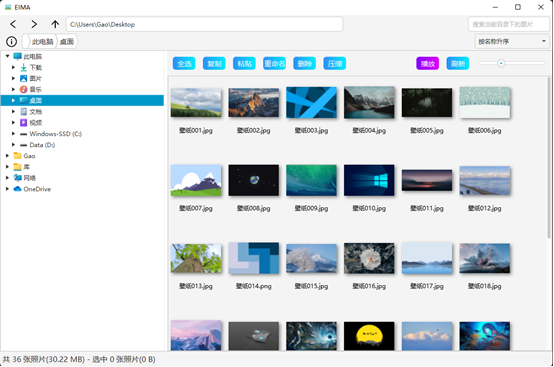
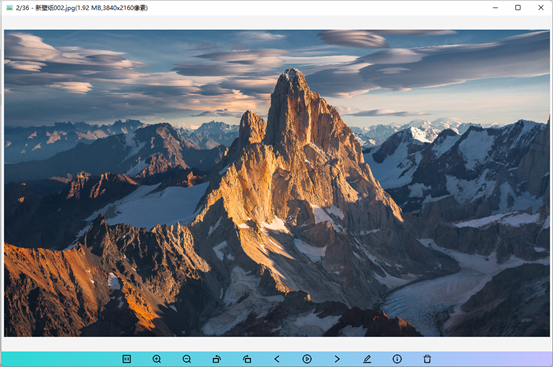
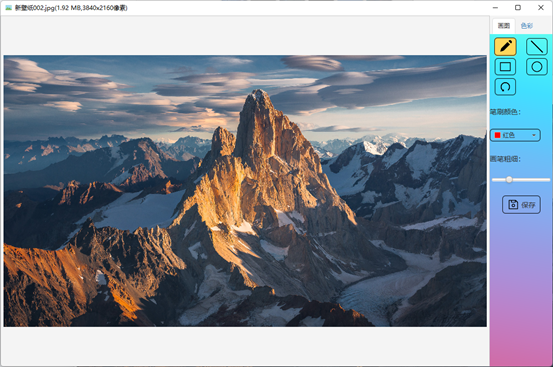

# 基于JavaFx的电子图片管理程序

## 采用JDK17+JavaFx18开发 ##

***

## 功能
* 异步加载的目录树
* 目录的前进和后退以及选择父目录
* 图片属性
* 图片搜索
* 图片排序
* 图片全选、单选、多选
* 图片复制、粘贴、删除、重命名、批量重命名
* 图片压缩
* 预览图大小调节
* 右键菜单
* 幻灯片窗口的图片切换
* 幻灯片窗口的图片放大缩小、旋转、拖动
* 幻灯片播放
* 图片的画图、标记
* 图片添加滤镜
* 图片编辑后导出保存
***

